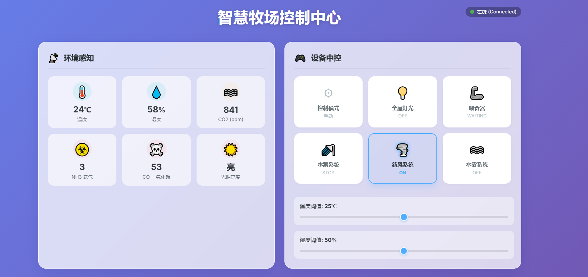
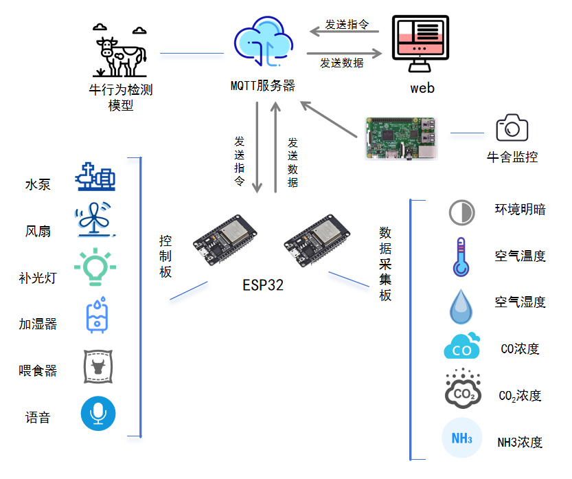
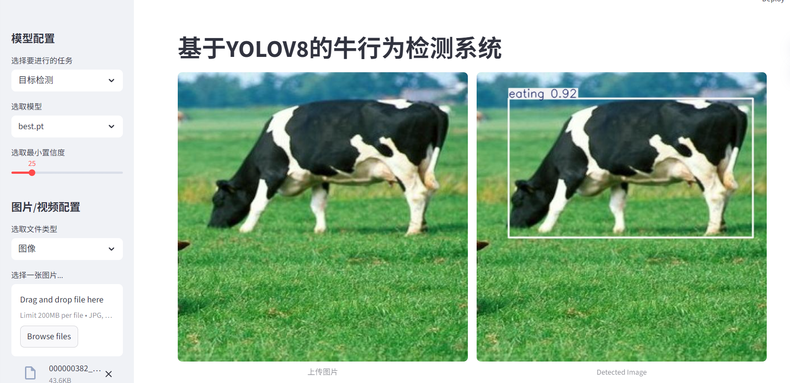
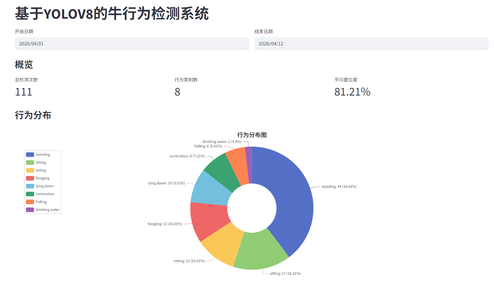

# 🐄 基于物联网与机器视觉的智慧牧场监控系统


> 面向中小型牧场的低成本、易部署的牛舍智能化监控解决方案。

## 📖 项目简介

本项目设计并实现了一套 **智慧牧场监控系统**，利用 **物联网 (IoT) + 边缘计算 + 云平台协同** 的轻量化架构，实现对牛舍环境的全方位监测、牛行为的智能识别以及设备的自动化控制。

系统以 **双 ESP32** 为核心构建传感器网络与设备执行层，以 **树莓派 4B** 作为图像采集边缘节点，云端基于 **YOLOv8n** 实现 8 类牛行为的精准识别，并提供了 **Web 可视化平台** 与 **语音交互** 功能。

## ✨ 功能特性

- **🌡️ 环境实时监测**  
  采集温度、湿度、CO、CO₂、NH₃、环境光照等参数，通过 MQTT 上传至云端。

- **🐮 牛行为智能识别**  
  基于 YOLOv8n 的轻量级模型，精准识别 **跌倒、饮水、进食、觅食、趴卧、反刍、坐卧、站立** 共 8 类行为，支持行为时长统计与可视化分析。

- **⚙️ 设备自动联动控制**  
  根据有害气体优先、温湿度阈值与定时策略，自动驱动 **风扇、水泵、补光灯、加湿器、喂食舵机** 等设备，实现 24 小时无人值守调控。

- **🎤 语音交互**  
  支持自然语言指令（如“太黑了”），依托大模型进行意图识别，驱动设备并语音反馈，降低操控门槛。

- **📊 Web 可视化**  
  基于 HTML/CSS/JS 的前端界面，集成环境数据面板、设备中控、实时监控画面及 Streamlit 行为统计看板。

- **🗄️ 数据存储**  
  使用 SQLite 轻量数据库存储行为识别结果，支持历史数据查询与分析。

## 🏗️ 系统架构

```text
┌─────────────┐     MQTT/HTTP     ┌──────────────────┐      WebSocket      ┌──────────────┐
│  ESP32 采集板 │ ────────────────> │                  │ <───────────────── │  Web 前端     │
│  (传感器集群) │                   │  华为云服务器      │                    │  (监控面板)   │
└─────────────┘                    │  FastAPI + DB     │                    └──────────────┘
                                    │  YOLOv8n 推理     │
┌─────────────┐     MQTT/HTTP     │  自动决策算法       │
│  ESP32 控制板 │ <──────────────── │                  │
│  (执行设备)   │                   └──────────────────┘
└─────────────┘                            ↑  ↑
                                            │  │ MQTT (图像上传)
┌─────────────┐                            │  │
│  树莓派 4B    │ ─────────────────────────┘  │
│  (摄像头采集) │                              │
└─────────────┘                              │
                                             │
┌─────────────┐                            │
│  INMP441 麦克风 │ ── 语音流 ──> Qwen3-Omni-Flash ──> 意图解析 & TTS 反馈
└─────────────┘
```

**数据流转**：传感器 / 图像 → Edge (ESP32 / 树莓派) → Cloud (MQTT Broker → FastAPI → DB / Model) → 决策反馈 → 设备执行 / 前端展示。

## 🧰 硬件清单

| 模块         | 型号 / 说明            | 功能                |
| :----------- | :--------------------- | :------------------ |
| 微控制器     | ESP32 (×2)             | 数据采集 + 设备控制 |
| 边缘计算机   | 树莓派 4B              | 图像采集与预处理    |
| 温湿度传感器 | DHT11                  | 监测牛舍温湿度      |
| 气体传感器   | GY-SGP30 / MQ7 / MQ135 | CO₂、CO、NH₃ 浓度   |
| 光照传感器   | 光敏电阻模块           | 环境明暗判断        |
| 音频输入     | INMP441                | 语音指令采集        |
| 音频输出     | MAX98357A              | 语音反馈播放        |
| 执行设备     | 继电器 + 风扇/水泵等   | 环境调控            |
| 喂食机构     | 舵机                   | 自动投料            |

## 💻 软件技术栈

- **边缘层**：Python 3.9 (树莓派) / MicroPython (ESP32)
- **云端后端**：FastAPI (Python)
- **数据库**：SQLite
- **模型推理**：YOLOv8n (Ultralytics) ，TensorFlow Serving 部署
- **前端**：HTML + CSS + JavaScript，Streamlit (行为统计)
- **通信协议**：MQTT 3.1.1 (设备 ↔ 云端)，WebSocket (前端)
- **语音服务**：Qwen3-Omni-Flash (语音识别 + TTS)
- **运行环境**：华为云 Ubuntu 24.04.3 LTS

## 📂 目录结构

bash

```
.
├── API/                  # 后端 API 服务代码
│   ├── .idea/            # IDE 配置
│   ├── .env              # 环境变量
│   ├── API.py            # API 主程序
│   ├── audio_assistant_response.wav  # 语音反馈音频
│   └── start.wav         # 启动提示音
├── app/                  # Web 前端应用
│   ├── .git/             # Git 版本控制
│   ├── .vscode/          # VSCode 配置
│   ├── node_modules/     # Node.js 依赖
│   ├── app.zip           # 应用压缩包
│   ├── index.html        # 主页
│   ├── package.json      # 项目配置
│   ├── package-lock.json # 依赖锁定
│   ├── script.js         # JavaScript 逻辑
│   └── style.css         # CSS 样式
├── ESP32/                # ESP32 数据采集板程序
│   ├── .git/
│   ├── .vscode/
│   ├── build/
│   └── ESP32.ino         # Arduino 源代码
├── ESP32S3/              # ESP32S3 控制板程序
│   ├── .git/
│   ├── .vscode/
│   ├── build/
│   ├── ESP32S3.ino       # Arduino 源代码
│   └── ESP32S3.txt       # 说明文件
├── cattle_yolo/          # 牛行为识别核心模块
│   ├── .claude/
│   ├── .idea/
│   ├── .vscode/
│   ├── __pycache__/
│   ├── img_video/
│   ├── weights/
│   ├── app.py            # Streamlit 可视化入口
│   ├── config.py         # 配置文件
│   ├── database.py       # 数据库操作
│   ├── utils.py          # 工具函数
│   ├── visualization.py  # 数据可视化辅助
│   ├── requirements.txt  # Python 依赖
│   ├── readme.txt        # 原说明文件
│   └── ...
└── README.md
```

## 📸 前端效果展示

```
### 网页界面


### 系统框架图


### 牛行为识别


### 行为统计

```


## 📄 许可证

本项目仅供学习与交流使用，引用请注明出处。如需商用，请联系作者。